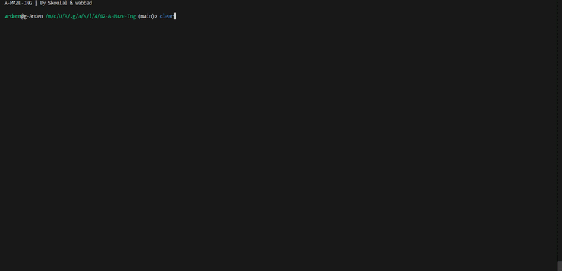
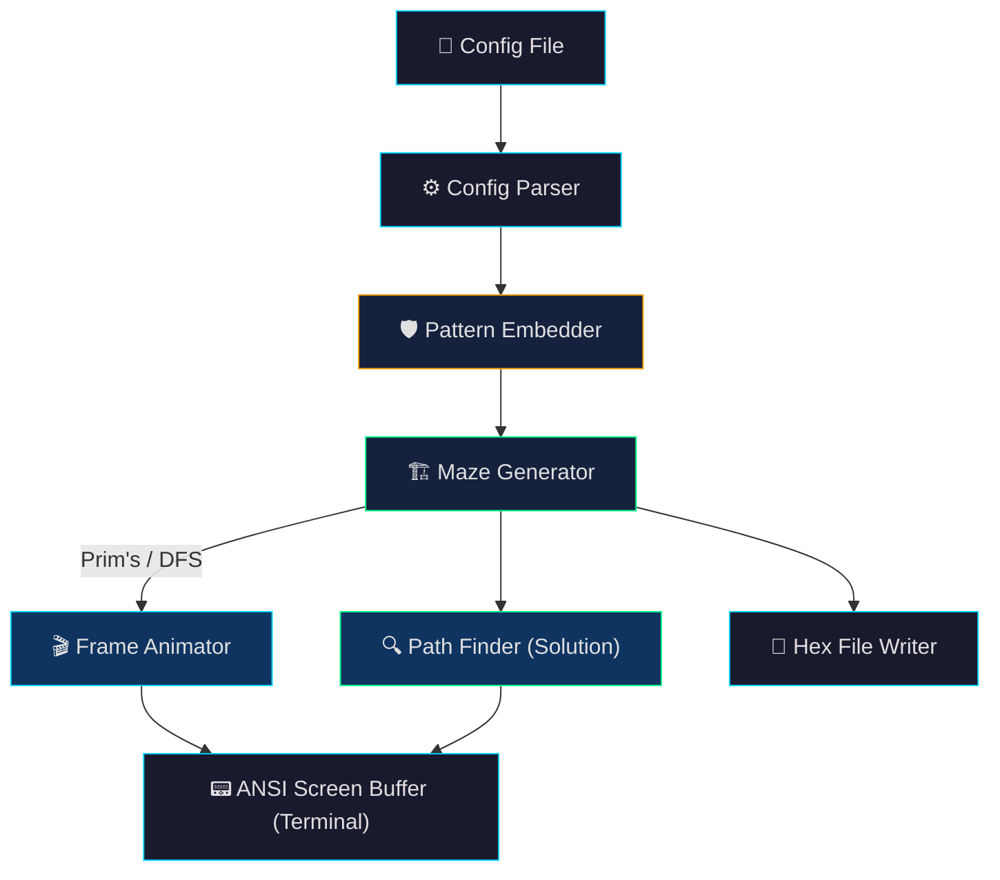

<p align="center">
  
</p>

<h1 align="center">🧩 A-Maze-Ing</h1>

<p align="center">
  <b>A perfect maze generator with real-time terminal animation, hex encoding & interactive controls</b>
</p>

<p align="center">
  
  
  
  
</p>

---

<p align="center">
  
</p>

<p align="center"><i>▲ Real-time animated maze generation in the terminal</i></p>

---

## Overview

**A-Maze-Ing** generates *perfect mazes* — mazes with exactly **one unique path** between any two cells. The engine implements both **Prim's Algorithm (Frontier-based)** and **Recursive Backtracker (DFS)**, supports embedding custom structural patterns (e.g. "42" / "1337"), generates hexadecimal wall encodings, and renders an animated visualization directly in the terminal at 60 FPS.

### ✨ Key Features

- 🎲 **Dual Generation Algorithms** — Prim's (branching complexity) and DFS (long winding corridors)
- 🎬 **60 FPS Terminal Animation** — smooth step-by-step rendering with ANSI screen buffers
- 🎮 **Interactive Runtime Controls** — regenerate, cycle color schemes, and animate solution paths on the fly
- 🔢 **Hex Wall Encoding** — compact 4-bit per cell binary encoding exported to file
- 🛡️ **Pattern Protection** — embeds custom patterns ("42" / "1337") into the maze grid without breaking solvability
- 📦 **Modular Package** — core logic bundled as the reusable `mazegen` library (see [`docs/package_usage.md`](docs/package_usage.md))

---

## Architecture



---

## Getting Started

### Prerequisites
- Python 3.10+
- `pip` for dependency management

### Installation

```bash
git clone https://github.com/DaftTake/A-Maze-Ing.git
cd A-Maze-Ing

# Create and activate virtual environment
python3 -m venv venv
source venv/bin/activate    # Linux/macOS
# venv\Scripts\activate     # Windows

# Install dependencies
make install
```

### Usage

```bash
# Run with default configuration
make run

# Or run directly with Python
python3 a_maze_ing.py config/default_config.txt
```

---

## Interactive Controls

Once the maze finishes generating, an interactive prompt lets you explore:

| Option | Action |
|---|---|
| `1` | **Regenerate new maze** (toggles between Prim's and DFS, randomizes seed) |
| `2` | **Show / Hide solution path** (smooth step-by-step path animation) |
| `3` | **Change color theme** (cycles *default*, *vivid*, *emerald*, *ocean*, *amber*) |
| `4` | **Quit** |

---

## Configuration

The configuration file uses `KEY=VALUE` pairs:

```ini
# Maze dimensions
WIDTH=20
HEIGHT=15

# Entry and exit coordinates (x,y)
ENTRY=0,0
EXIT=19,14

# Output file
OUTPUT_FILE=maze_output.txt

# Perfect maze (exactly one path between entry and exit)
PERFECT=True

# Random seed for reproducibility (optional)
SEED=42
```

> Lines starting with `#` are treated as comments.

---

## Algorithms Implemented

### 1. Prim's Algorithm (Frontier-based)
- **Characteristics**: High branching factor, short dead ends, organic and complex structure.
- **How it works**: Starts from an initial cell and expands the frontier set, randomly carving walls to unvisited adjacent cells until all cells are connected.

### 2. Recursive Backtracker (DFS)
- **Characteristics**: Low branching factor, long winding passages (high "river" factor).
- **How it works**: Uses stack-based depth-first search to carve passages as far as possible before backtracking.

---

## Project Structure

```
A-Maze-Ing/
├── a_maze_ing.py          # Main executable entry point
├── pyproject.toml         # Package definition (mazegen)
├── Makefile               # Build, run, lint, and clean automation
├── requirements.txt       # Dependencies (flake8, mypy)
├── config/
│   └── default_config.txt # Maze configuration file
├── docs/
│   └── package_usage.md   # Documentation for using mazegen as a library
├── src/
│   └── mazegen/
│       ├── algorithms/    # Prim's, DFS, and PathFinder
│       ├── rendering/     # Screen buffer, frame renderer, animator
│       └── utils/         # Config parser, file writer, pattern embedder
└── assets/
    ├── banner.jpg         # Project banner visual
    └── demo.gif           # Terminal animation demo
```

---

## Reusable Library: `mazegen`

The maze engine is packaged for standalone use:

```python
from mazegen import MazeGenerator

# Initialize and generate
generator = MazeGenerator("config/default_config.txt")
maze = generator.generate_maze()

# Solve
solution = generator.get_solution()
print(f"Solution: {solution}")
```

See [`docs/package_usage.md`](docs/package_usage.md) for full API details.

---

## What I Learned

- **Graph Algorithms in Practice** — implementing MST (Prim's) and DFS traversal for maze synthesis.
- **Terminal Rendering Architecture** — building double-buffered ANSI frame rendering for flicker-free 60 FPS animations.
- **Bitwise State Representation** — encoding 4 directional walls into a single hexadecimal character per cell.
- **Collaborative Engineering** — defining clean module boundaries between core generation, rendering pipelines, and package configuration.

---

## Team

Built collaboratively as part of the [42 Network](https://42.fr/) curriculum:

| Role | Member | Scope |
|---|---|---|
| **Core Logic** | [Salah Eddine Koulal](https://github.com/salah-koulal) (skoulal) | Maze generation, algorithms, file I/O |
| **Interface & Integration** | [Walid Abbad](https://github.com/DaftTake) (wabbad) | Visualization, packaging, integration |

---

## License & Credits

Educational project created for [1337](https://1337.ma/) / [42 Network](https://42.fr/).

---

<p align="center">
  <sub>Built with ❤️ at <a href="https://1337.ma/">1337 Rabat</a> (42 Network) 🇲🇦</sub>
</p>
